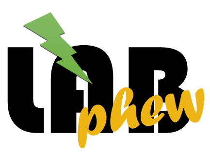

***********************
Welcome to labphew docs
***********************

*labphew* (lowercase) is a minimalist functioning code module and folder structure. While trying to be a standalone and
accessible module, *labphew* is, first and foremost, built to teach and exercise with computer-controlled
measurements using Python.

labphew is meant to be:
-----------------------

+ out-of-the-box package, capable of communicating with :doc:`./devices`.
+ instructive code documentation that allows users to learn how it works and how to customize it.
+ a low entry-level template for building new user-interfaces for a measurement.
+ a good example of structuring lab-automation code and how to document it.
+ fun to play with, edit, and contribute to the code.

labphew is NOT meant to:
------------------------
+ grow into a comprehensive package for controlling all sorts of devices.
+ be the fastest in performing a task or push its performance to the physical limits.
+ stay backward-compatible.

You can find the code of this package on `Github <https://github.com/sanlifaez/labphew>`_.
The documentation is hosted on `Read The Docs <https://readthedocs.org/projects/labphew>`_.

.. toctree::
   :maxdepth: 4
   :caption: Further in the docs:

   introduction
   installation
   howtolabphew
   walkthrough
   labphew.model
   labphew.view
   labphew.controller
   labphew.core
   labphew.logging
   examples
   devices
   customize
   contribute
   api

Acknowledgement
===============
This project is heavily inspired by the instruction exercise written by Dr. Aquiles Carattino,
the mastermind behind Python for the Lab (PFTL).
PFTL is developed by `Uetke <https://www.uetke.com>`_.
If you want to learn more (very serious!) coding for lab automation with Python,
check the excellent `PTFL website <https://www.pythonforthelab.com/>`_ or register for a course at `Uetke <https://www.uetke.com>`_.

An earlier and more sophisticated derivation of this software, PyNTA, which uses the multiprocessing library of Python
and the distributed messaging library pyZMQ, has been explained in
`this preprint <https://www.preprints.org/manuscript/201906.0251/v1>`_ - doi: 10.20944/preprints201906.0251.v1.
`PyNTA <https://github.com/nanoepics/pynta>`_ is capable of real-time particle tracking on Megapixel
images at a 50 Hz rate.

Other Python resources for lab automation
=========================================

If you are an experience Python programmer, labphew might be too basic for your needs.
These are some other open-source instrumentation projects under development, which might be interesting for you (no guarantees!):

+ `autolab <https://github.com/qcha41/autolab>`_
+ `lantz <https://github.com/LabPy/lantz>`_
+ `labpy <https://gitlab.com/LARAsuite/labpy>`_
+ `experimentor <https://github.com/aquilesC/experimentor>`_

If you know of a package that should be added to this list, please do not hesitate to drop us a message.