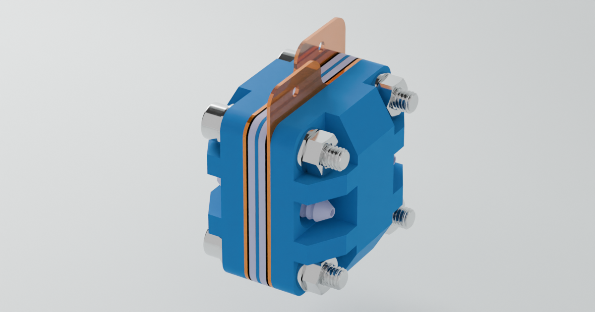
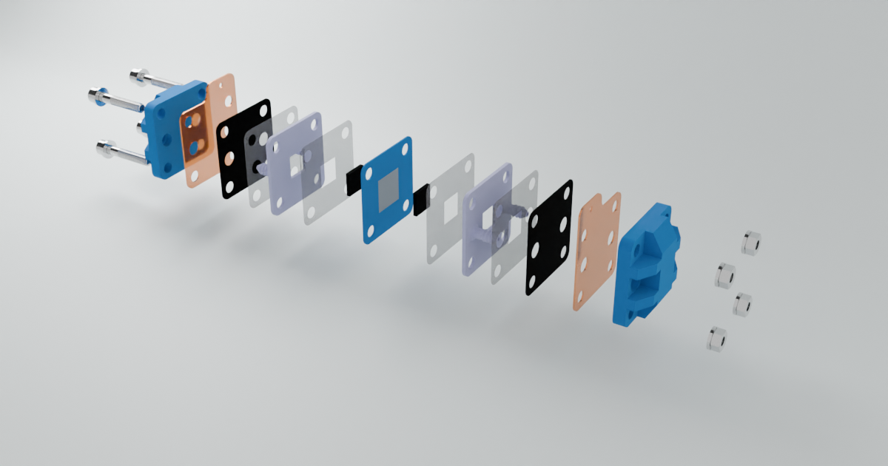
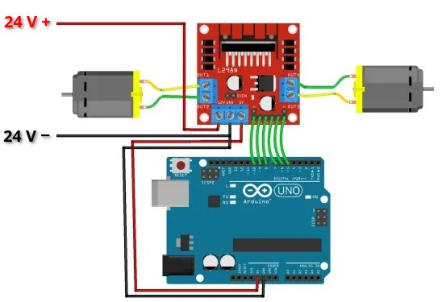
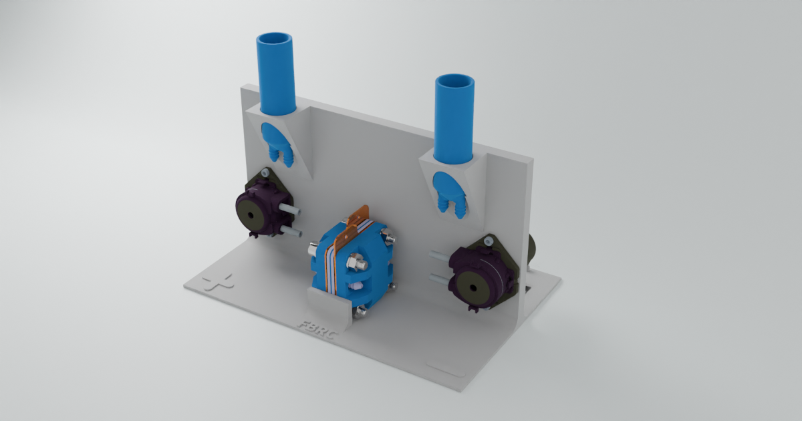
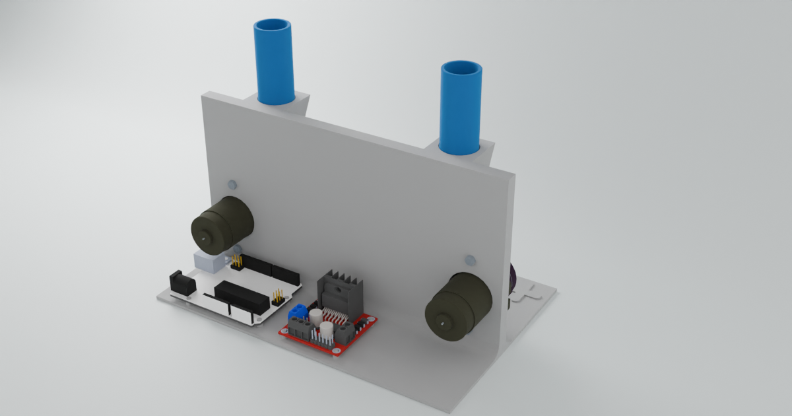

# Components

In this section, we will delve into the main components that you will construct for this project. These components are vital to the overall functionality and efficiency of the system. For more detailed specifications, please refer to the FBRC website, linked in the FBRC section of this document.

## Flow Cell

The **flow cell** serves as the core of the battery system, where the crucial **redox reactions** take place, and the electrical current is generated. This component is integral to the functionality of the entire setup, as it facilitates the conversion of chemical energy into electrical energy.

### Key Components of the Flow Cell:

- **Brass and Grafoil Current Collectors**: As discussed in the "Battery 101" section, current collectors are responsible for either accepting or donating electrons during the redox process. In this design, we use a combination of **brass** and **grafoil**. Brass is highly conductive, making it an excellent choice for current collection, while grafoil, under standard conditions, is chemically inert to the electrolyte, ensuring longevity and stable performance.

- **Porous Graphite Felt**: The porous graphite felt acts as the conductor within the flow cell. Its **porous structure** is key, as it provides a **high surface area**, allowing for increased reaction efficiency. This makes it ideal for facilitating the flow of electrons and ions during the redox process.

- **Separator Sheet Membrane**: A critical component in electrochemical cells, the separator sheet membrane prevents direct contact between the different solutions in the flow cell,. In this setup, **photo paper** is used as the membrane due to its availability and cost-effectiveness.

Here are some images of the flow cell:

|  |  |
|--------------------------------------------------|-------------------------------------------|

## Pumps

To control the flow of the electrolyte solution within the system, two pumps are utilized. These pumps are connected to **two reservoirs** that hold the electrolyte solutions, and the flow rate is carefully regulated.

### Key Features of the Pump System:

- **Peristaltic Pumps**: Small **peristaltic pumps** are employed in this project. These pumps function by squeezing a tube, moving the liquid through it in a controlled manner. 

- **Control via Microcontroller**: The pumps are controlled by an **Arduino Uno R3** microcontroller, which regulates the electrolyte flow. 

## Microcontroller

As mentioned, the **Arduino Uno R3** microcontroller regulates the flow of electrolyte solution. Arduino microcontrollers are easily programmable and very well documented, making it ideal for all sorts of projects.

## Jig

To keep all components aligned and secure, a **jig** is used to hold everything in place. The jig ensures that the flow cell, pumps, reservoirs and microcontroller are all properly positioned and sturdy during operation. The complete jig with componants is found below.

|  |  |
|---------------------------------------|-------------------------------------|

