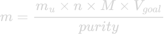

# Synthesis of Vanadium Electrolyte
We plan on making 2 electrolytes where all chemical energy is stored vanadium cathions. When completely charged, one electrolyte contains V(V) ions and the other contains V(II) ions. These will respectively be converted to a V(IV) and V(III) solution.

## Material
---
- TTi QL335P linear regulated power supply
- 2.6 M (or higher) H2SO4 solution
- VOSO4
- Demi water
- 2 plastic ≥100 mL plastic beakers
- Plastic tubes for humidified nitrogen/argon supply and connection of electrolyte tanks to the battery cell

## Theory
---
The following half reactions and redox reaction will take place in the electrolyte [1][2]:

|\# |Reaction | ΔE |
|-|--- | ---:|
|1| V3+ +  e- &rarr; V2+ | - 0.255 V vs. SHE|
|2| V(IV)O2+ + H2O &rarr;  V(V)O2+ +  2 H+ + e- |  1.004 V vs. SHE|
|3| V2+ + 2 VO2+ +  4 H+ &rarr; V3+ + 2 VO2+ + 2 H2O |  1.259 V|

**Table 1**\

Reaction 3 is the reaction of the battery discharging. \
The solution will consist of other chemical components which can undergo half reactions as well [3]:

|\# |Reaction | ΔE |
|-|--- | ---:|
|4|2 H+ + 2 e- &rarr; H2 | 0 V vs. SHE|
|5| 4 H+ + O2 + 4 e- &rarr; 2 H2O | 1.23 V vs. SHE|
|6|2 H+ + SO42- &rarr; H2O + SO32- | - |

**Table 2**

The electropotential of the reduction of SO42- is unknown to us. However, we suspect it is very negative since H2SO4 is a strong acid. Also there is no gas formation, so this reaction should cause no danger if it happens. \
The reduction of O2 with H+ has a higher potential than that of the reduction of VO2+. \
This would mean that in presence of O2, instead of reaction 3, the following redox reaction would occur:

|\# |Reaction | ΔE |
|-|--- | ---:|
|7|2 V2+ + 4 H+ + O2 &rarr; 2 V3+ + 2 H2O | |

**Table 3**

This would lead to the ratio of V(IV)/V(III) becoming less than one (with an initial ratio of 1:1 of V(V)/V(IV) before discharge).
This would also cause a disbalance in the V(V)/V(II) ratio when the battery is then charged. This disbalance results in loss of capacity.
To retain capacity through charge/discharge cycles, the solution containing V2+ should be anaerobe.
Reaction 4 also shows that formation of hydrogen is possible acidic environments. This means the solution should at all times be able to release this gas to the atmosphere to prevent the cell from exploding.

## Preperation of V(IV)-solutions
---
IMPORTANT: before working with any chemical compound, it is important to check its MSDS (Material Safety Data Sheet) and its reactivity with air, water and other compounds in the electrolyte.
A MSDS can be found by simply typing the name of the compound with MSDS after it into any search engine.

The synthesis of our electrolyte is based on O'Connor, 2021 [6]. The goal of this experiment is to synthesize a fully charged battery. In other words, one container should contain V(V) (no V(IV)) and the other container should contain V(II) (no V(III)). Our starting compound is V(IV) in the form of VOSO4. By oxidizing VO2+ in one halfcell, while reducing VO2+ on the other halfcell, the desired electrolyte can be synthesized:

|\# |Reaction | ΔE |
|-|--- | ---:|
|8| VO2+ +  2 e- &rarr; V2+ + O2-| -|
|9| VO2+ + H2O &rarr; V(V)O2+ + 2 H+ + e- |  - 1.004 V vs. SHE|

**Table 4** \
Since reaction 8 is a double reduction and reaction 9 is only a singular oxidation, the oxidation side of the cell requires twice as much V(IV) as the reduction side of the cell.

It is important to understand that half reactions 8 and 9 are part of the synthesis of the electrolyte of the cell. Even though these reactions together form a redox reaction, these synthetic half reactions shouldn't be assigned to charging process of the cell. The charging and discharging of the cell is exclusively reversible redox reaction 3 from Table 1. \
The electrolytes are made acidic with H2SO4 to prevent V(V) from precipitating [5]. To calculate how many grams of your starting compound you are required for a V(IV) solution of certain molarity, the following equation can be used:

 &emsp; (equation 1)

Where *m* is the mass VOSO2 you should add to get the desired molarity of your solution, *mu* is the molar mass of the compound your adding in g mol-1. In this case mu is the molar mass of VOSO2, 131.00 g mol-1. *n* is the amount of atoms of the desired compound within your salt. 1 mol VOSO2 contains 1 mol V, so n = 1. *M* is the desired molarity in mol L-1, *Vgoal* is the desired volume of your solution in L and purity is the purity of your starting compound in percentage **3**.\
It might be the case that the concentration of your H2SO4 solution is higher than you want it to be. In that case it is possible to dilute it with demi water. Using the following equation, you can determine how much H2SO4 solution you should dilute:

 &emsp; (equation 2)

Where *V0* is the volume of your original  solution H2SO4 in L, *Mgoal* is desired molarity of your desired H2SO4 solution in mol L-1, *M0* is the molarity of the original H2SO4 solution in mol L-1 and *Vgoal* is the volume of your desired H2SO4 solution in L. \

First make a 150 mL 2.6 M H2SO4-solution.
Using equation 1 and 2, we make 150 mL 1.5 mol L-1 V(IV) solution. We use VOSO4 for this.
50 mL of this solution is used for the reduction (reaction 7) and 100 mL for the oxidation (reaction 8). Both solutions should have a blue, transparent colour caused by V(IV).\
It is important to enable these tanks to release possibly formed gasses to prevent your cell from exploding. It is also important that these tanks are made of a material which is inert to an acidic environment.

## Synthesis of the electrolyte
---
Each solution should be connected to one half of the cell. To prevent reaction 7, we put a humidified nitrogen/argon stream through the reductor tank (reaction 8).\
Again, it is important to keep in mind that the following redox reaction is the synthesis of the charged electrolyte of the battery. This reaction is not the actual charging reaction once the battery is in actual use.\
The voltage on the cell can then be derived from Ohm's law:

 &emsp; (equation 3)

Where *U* is the voltage on the electric circuit in V and *R* is the resistance of the circuit in Ω. This means that the voltage and the current through the cell can't be modulated simultaneously.

Because of the internal resistance of the battery, we need to supply the cell with an overpotential higher than the 1.259 V of reaction 3. We charge the battery with a current 50 mA cm-2. As soon as the voltage reaches an overpotential of 1.75 V, we disconnect the battery from the power supply and stop the flow of the electrolyte. The battery should have now reached a state of charge (SOC) of about 90%.\
We can calculate the time it takes for a redox reaction to go from one side of the reaction to the other with the following equation:

 &emsp; (equation 4)

Where *t* is the time it takes for redox reaction to move completely from one side of the reaction to the other in seconds. Specifically for a battery, t is the charging time. ne is the total amount of transferred electrons in the redox reaction in mol, ℱ is the Faraday constant which is 96485 C mol-1 and *I* is the electric current through the cell in C s-1. \
> **Example:** You have have a 50 mL 1.5 M VOSO2 solution for the negative cell. This is 0.075 mol VOSO2.  When looking at reaction 8, you can see there is a transfer of 2 mol electrons per 1 mol of VOSO2. This means n = 0.15 mol e-.\
One could also find this value coming from the positive cell. Here you have a 100 mL 1.5 M VOSO2 solution. Looking at reaction 9, there is one mol electron transfer for 1 mol VOSO2. This also leads to n = 0.15 mol e-.\
For example, you have a membrane is 32 cm2. Considering a current density of 50 mA cm, this means *I* = 1.6 A. \
If you synthesize a 90% SOC electrolyte,   this would then take 0.9 * (0.15 mol *  96485 C mol-1 / 1.6 A) = 8140 s = 2h and 15 min.

The electrolyte synthesis can be assumed to be finished, when the reducing solution (reaction 8) has become purple and the oxidizing solution has become yellow **4**.
It is important to keep the V(II)/V(III) electrolyte anaerobe. We do this by maintaining the the stream of humidified nitrogen/argon gas through the electrolyte or by applying a film of paraffin oil on top the electrolytes after the synthesis (to save nitrogen/argon gas).

## Challenges
---
- In some reaction tables, the electropotential is left blanc. This is because this value is unknown to us. Knowing some of these values might lead to valuable insights.
- Determining the end of the synthesis of the charged electrolyte based on the reduced solution becoming purple is a qualitative method. It would be be better to quantitatively determine the end of the synthesis for by instance tracking the conductivity of the electrolyte or using spectroscopy.

### Footnotes
---
**1** In our case our starting compound is VOSO2

**2** In our case there is 1 V(IV) atom in 1 VOSO2 molecule

**3** This should be given by the supplier of your V(IV) salt in the product description

**4** Colours of V(V), V(IV), V(III) and V(II) oxidation states are respectively yellow, green, blue and purple [5].

### What should be added to this document?
---
- I'm not entirely sure if the reverse reaction 2 happens before the reverse of reaction 5, since reaction 5 requires 2 electrons. V is J/C, so I would suspect that that the reverse of reaction 5 yields more stable products.
- Not all reaction's electropotential are known to us yet.
- Pictures of our experimental setup should be added to this document.
- I'll try to find a paper/website which has a clear description of how to do molar calculations. This paper will be put in theory.
- Complete the material list (how much tube and what is the diameter of this tube)

## Bibliography
---
[1] Molchanov, B. (2016). Development and testing of mechanically stable Vanadium redox flow battery.

[2] Choi, N. H., Kwon, S. K., & Kim, H. (2013). Analysis of the oxidation of the V (II) by dissolved oxygen using UV-visible spectrophotometry in a vanadium redox flow battery. Journal of the Electrochemical Society, 160(6), A973.

[3] Binas (6th ed.). (2013). [Book]. Noordhoff Uitgevers.

[4] Wan, C. T. C., López Barreiro, D., Forner-Cuenca, A., Barotta, J. W., Hawker, M. J., Han, G., ... & Buehler, M. J. (2020). Exploration of biomass-derived activated carbons for use in vanadium redox flow batteries. ACS Sustainable Chemistry & Engineering, 8(25), 9472-9482.

[5] Jim Clark (2003 (modified June 2015)), VANADIUM, https://www.chemguide.co.uk/inorganic/transition/vanadium.html

[6] O'Connor, H., Bailey, J. J., Istrate, O. M., Klusener, P. A., Watson, R., Glover, S., ... & Nockemann, P. (2022). An open-source platform for 3D-printed redox flow battery test cells. Sustainable Energy & Fuels, 6(6), 1529-1540.
