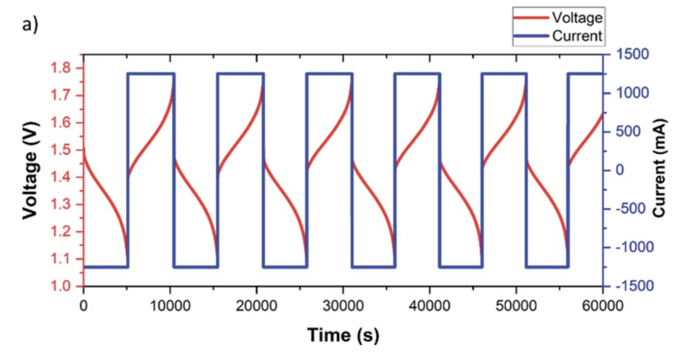

# Charge-Discharge Testing
This protocol is meant to test the battery on it's behaviour in voltage as function of time and used capaicity. This document is based on the section "
Charge–discharge testing" in [O'Connor, 2021]. This experiment should generally be possible for any redox-flow battery. However, the values for voltages and currents we use in this document consider the use of a vanadium redox-flow battery (VRFB).\

## Glossary
---
- **Negative tank** The tank containing the V(II)/V(III) solution (violet/green)
- **Positive tank** The tank containing the V(V)/V(IV) solution (yellow/blue). This solution might be black instead of coloured.
- **V3.5** is a short way descirbe two electrolytes, one containing V(III) (no V(II)) and the other of V(IV) (no V(V)).
- **VRFB** Vanadium redox-flow battery

## Material
---
- Programmable power Supply  (*TTi QL335P linear regulated power*)
- A battery cell
- Vanadium electrolyte
- (Optionally) Potentiostat

## Experiment
---
#### Making the battery anaerobe
When performing this experiment, the system should be kept anaerobe. This can be done by putting a nitrogen stream through negative tank. Another option to apply a film of paraffin oil on top the electrolytes in the tanks [3]. This doesn't require you to supply the cell with constant stream. However, parts of the cell that are not airtight might still allow oxygen into the system.\
It is important to not make the entire battery airtight. In the cell hydrogen might be formed. If the entire battery is airtight, the battery can explode.\

#### Charge-discharge cycles
This experiment consists of charging and discharging the battery with constant current. Upon charge the current should be positive, upon discharge the current will be negative.\
Based on the colour of your electrolytes, it's possible to know the sign of the current you should start with. If your electrolytes are black/yellow and purple, then your battery is charged. This means you should start with a negative current. If your electrolytes are blue/black and green, it means your battery is discharged. In this case you should start with a positive current.\
The amount of current run through the battery cell is dependent on the size of your membrane. Use a flow rate of the electrolytes through the cell of 25 min<-1> and keep this rate constant over the experiment. In [O'Connor, 2021] the current per area is ± 50 mA cm2. Fig. 1 [1], shows an example of current cycles:\

**Figure 1** An example of charge-discharge cycles of a VRFB from [O'Connor, 2021]. The used solution here is 1.5 M V3.5 in 3M H2SO4. The membrane has a surface of 25 cm2 and the flow rate is 25 mL min-1.

 As you can see in Fig. 1, the cycles take quite some time. Best would be to have a tracking system, which can track the important quantities for you: voltage (V), time (s), current (A) and optionally capacity (A.h). A device which could track these values would be a potentiostat. If you do not own a potentiostat, 1 cycle would suffice. However the more cycles you track, the more you will know about your battery.\
 In case that your potentiostat or powersupply can't show used capacity, you can determine the capacity by taking the product of the current and the time since that has past since the last flip of the direction of the current.
 The data can plotted as voltage and current as function of time (see Fig. 1). Another way to show the data is to plot voltage as a function of capacity.\
 In the folder of this document, there will be a folder called "Script_plots". This folder contains a python script "Script_plots.py" and an instruction file on how to use this script "Instructions_script.md".\
 In case you're using a potentiostat, make sure it can supply high enough currents and voltages. If it can, it will probably come accompanied by a software program which can generate the necessary data in plots for you.

## Possibility of black solution (instead of coloured)
---
In our experiments we noticed that the electrolyte sometimes turned black. In our case this was the positive electrolyte. Our hypothesis is that this happens due to some of the electrode (carbon) dissolving in the acidic electrolyte. The reason why this happens on the positive side and not the negative can be explained by looking at the half reactions happening upon charging:

|\# |Reaction | ΔE |
|-|--- | ---:|
|1| V3+ +  e- &rarr; V2+ | - 0.255 V vs. SHE|
|2| V(IV)O2+ + H2O &rarr;  V(V)O2+ +  2 H+ + e- |  1.004 V vs. SHE|

In reaction 1 there is no generation of H+. This half reaction corresponds to the negative electrolyte. Reaction 2 shows generation of 2 H+. This half reaction corresponds to the positive electrolyte. The generation of H+ lowers the pH of the positive side the battery cell, which could lead to dissolvement of the electrode on the positive side. In case of proton blocking membrane, the pH of the negative electrolyte stays the same.   

## Bibliography
---
[1] O'Connor, H., Bailey, J. J., Istrate, O. M., Klusener, P. A., Watson, R., Glover, S., ... & Nockemann, P. (2022). An open-source platform for 3D-printed redox flow battery test cells. Sustainable Energy & Fuels, 6(6), 1529-1540.
[2] REFERENTIE OVER KLEUREN
[3] Wei, Z., Bhattarai, A., Zou, C., Meng, S., Lim, T. M., & Skyllas-Kazacos, M. (2018). Real-time monitoring of capacity loss for vanadium redox flow battery. Journal of Power Sources, 390, 261-269.
