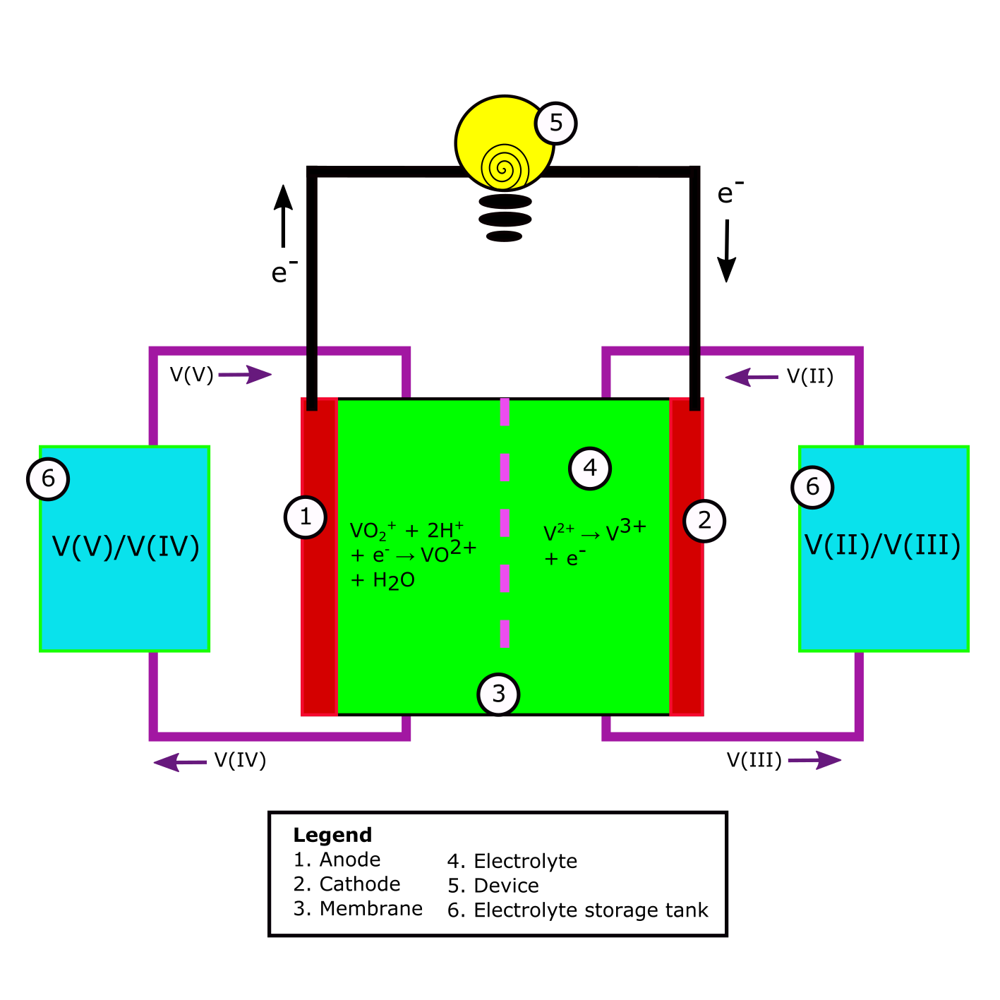

# Architecture of the cell

**Fig. 1** A schematic example of a Redox Flow Battery. All components described in the legend can be found in every RFB. The V(V)/V(II) to V(IV)/V(III) redox reaction is used as an example.

## Electrolyte
The electrolyte in a redox-flow battery is the solution in the battery containing the chemical compounds which hold the (chemical) potential energy of the cell. This energy can be released when these compounds undergo a redox-reaction. Below an example is given of 2 half reactions which together add up to one redox reaction [2][4].

|\#|Reaction | Δ*E* |
|-|--- | ---:|
|1| V3+ +  e- &rarr; V2+ | - 0.255 V vs. SHE|
|2| VO2+ + H2O &rarr;  VO2+ +  2 H+ + e- |  1.004 V vs. SHE|
|3| V2+ + 2 VO2+ +  4 H+ &rarr; V3+ + 2 VO2+ + 2 H2O |  1.259 V|

**Table 1**

Reaction 1 and 2 are the half reactions after which the electric potential is given. Reaction 3 is the total reaction. The theoretical electric potential of reaction 3 is the difference in electric potential of the half reactions. One can see these energies are given in V, which is J/C.

## Membrane
Following the example of Table 1, if one would add V3+ and VO2+ into a solution  without a membrane, the electron transfer of the oxidizer VO2+ to the reducer V3+ would happen at the side of the reaction. However, in an electrochemical battery, one controls the electron flow in order to use its energy. By putting putting a membrane between the solution containing the oxidizer and the solution containing the reducer, one doesn't allow the the oxidizer and reducer to be in direct contact. The electron transfer is happens via the so called electrodes (see Fig.1). In Fig. 1 at 5, a device can be added to be powered in case of discharge of the battery. In Fig.1 at 5, the charger can be located upon charging of the battery. \
The material of the membrane should be chosen to be non-reactive to the components in the of electrolyte and it should be permeable to the right components.
One often used categorization for membranes is the distinction between anion- and cathion-exchanged membranes [1]. In general, cathion-exchanged membranes are used for high power density applications, while anion-exchanged membranes offer easier transport management and higher efficiency. Cathion and anion membranes can be categorized under ion exchange membranes, for they filter charged particles. Other types of membranes are porous seperators, bilayer membranes and asymmetric membranes [3].

## Current Collector
As briefly stated before, the current collector is the material at which the half reactions within the electrolyte take place. It can either offer or take up electrons. The current collector where the reduction reaction takes place is called the cathode. The current collector where the oxidation reaction takes place is called the anode. When charging the battery, the cathode is labeled as negative and the anode as positive. Upon discharge, the cathode becomes positive and the anode becomes negative. In Fig. 1, a discharging battery is shown. If the direction of current would be turn around, i.e. the battery would be charged, the labeling would be change by switching 1 and 2. \
To get back tot the example of the vanadium half reactions upon discharge of the cell; V3+ +  e- &rarr; V2+ would take place on the cathode, while   VO2+ + H2O &rarr; VO2+ +  2 H+ + e- takes place on the anode.
A cell converting chemical energy to electric energy (discharging) is called a galvanic cell. A cell converting electric energy to chemical energy (charging) is called an electrolytic cell.\
The current collectors should sathisfy a few characteristics, depending on their specific use:
- They should be inert to the electrolyte. This usually involves being inert to acidic environmemts.
- They should be able to both offer and take up electrons to and from the electrolyte.
- They should be low resistance
- Ideally the should be porous to offer a large surface for the half reactions to take place.

## Current conductor
The current conductor is the part of the battery which conducts the current from the current collector to the other side of the cell. This can be the same material as the current collector, but could also be another material.\
The current conductor should sathisfy the following characteristics:
- It have a low resistance
- If the conductor is a different material than the current collector, there should be a good electron transmission between the material of the current collector and transmission

## The pump
The pump is located outside of the cell. The pump chooses the direction and speed of the electrlyte flow. The system contains one pump per halfcell.

### What should be added to this document?
- The pump into Fig. 1

## Bibliography
[1] Fumatech, https://www.fumatech.com/en/products/membranes-redox-flow-batteries/

[2] Molchanov, B. (2016). Development and testing of mechanically stable Vanadium redox flow battery.

[3] Gubler, L. (2019). Membranes and separators for redox flow batteries. Current Opinion in Electrochemistry, 18, 31-36.

[4] Choi, N. H., Kwon, S. K., & Kim, H. (2013). Analysis of the oxidation of the V (II) by dissolved oxygen using UV-visible spectrophotometry in a vanadium redox flow battery. Journal of the Electrochemical Society, 160(6), A973.
